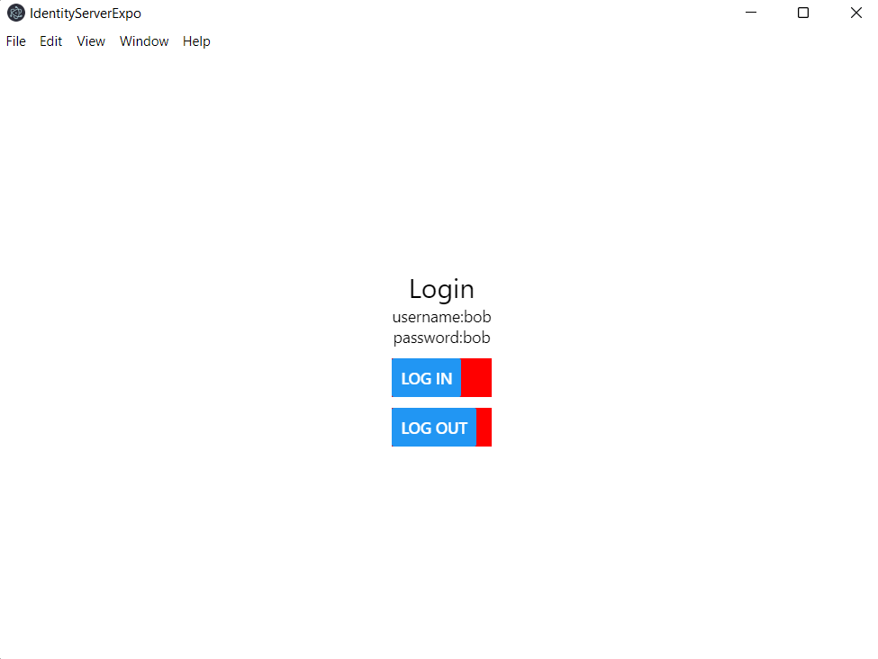
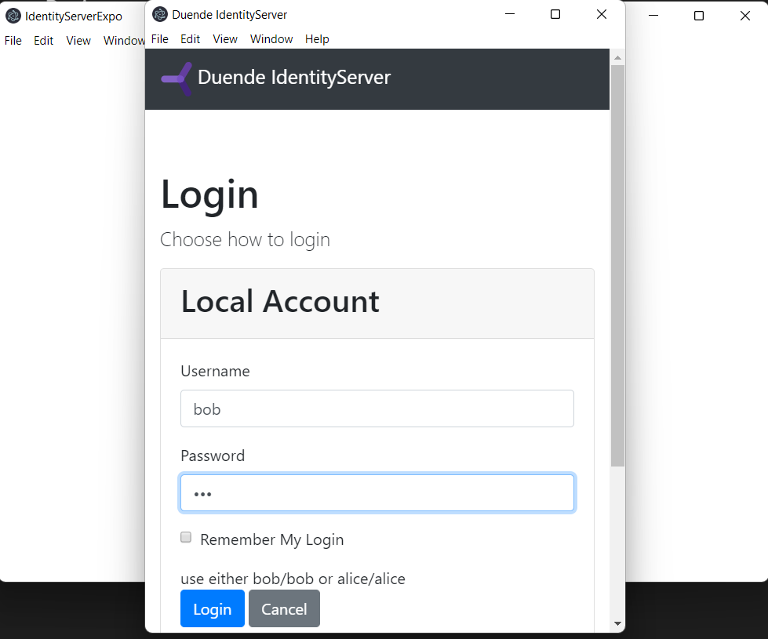
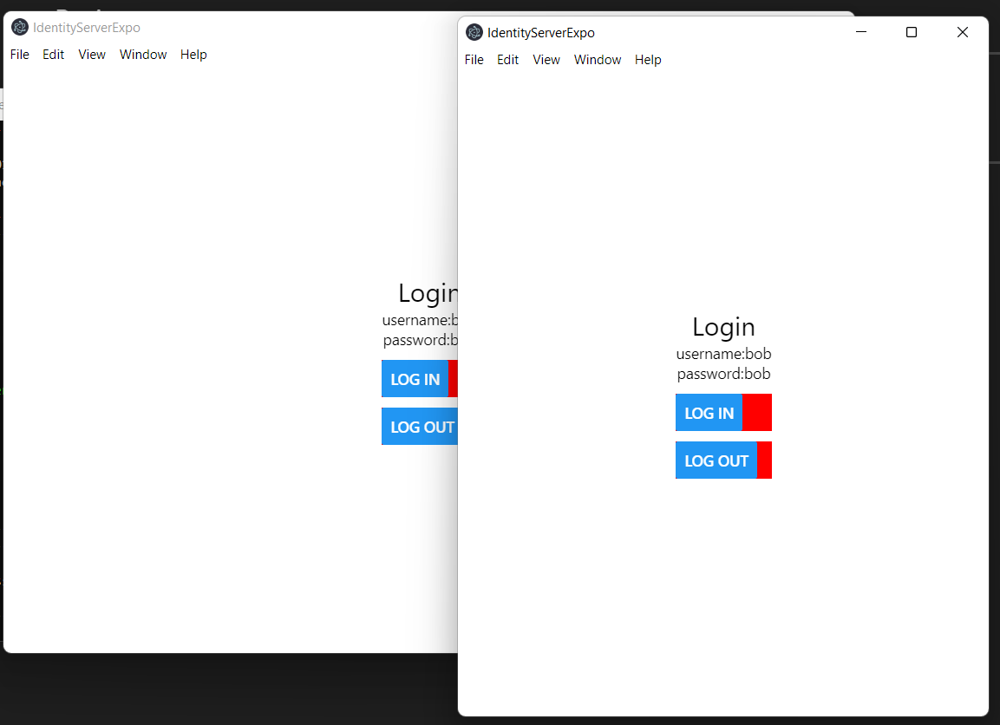

## Project
---
This project is created by using [Using Electron with Expo for Web](https://docs.expo.dev/guides/using-electron/) instructions.

## Usage project
---
$ yarn install

$ yarn expo-electron start

## Start up screen
*screen 1

## Login screen
*screen 2

## After successfully logging 
*screen 3
> **_NOTE:_**  After successfully logging, the login screen should close and return to desktop app.
